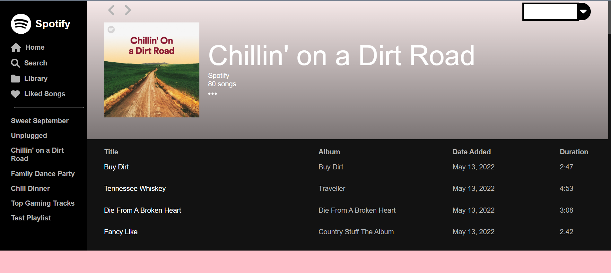

<div align="center">
  <h1>SpotifyApp</h1>
  <p>
    Front-end clone of the Spotify website. This project was created using `create-react-app`. The app should be used with the authentication server <a href="https://github.com/vintydong/spotify-auth-server">here</a>
  </p>
   
<h4>
    <a href="https://spotify-frontend-92031.herokuapp.com/">View Demo</a>
</h4>
</div>

<br />

<!-- Table of Contents -->

# Table of Contents

-   [About the Project](#star2-about-the-project)
    -   [Motivation](#motivation)
    -   [Tech Stack](#tech-stack)
    -   [Features](#features)
    -   [Environment Variables](#environment-variables)
-   [Getting Started](#getting-started)
    -   [Prerequisites](#prerequisites)
    -   [Installation](#installation)
    -   [Run Locally](#run-locally)
-   [Usage](#usage)
-   [Roadmap](#roadmap)
<!-- About the Project -->

## About the Project

<div align="center">
    
</div>
<div align="center">
    
</div>
<div align="center">
    
</div>
<div align="center">
    
</div>

### Motivation

This project was created mainly as a way for me to learn React frontend development. I tried to imitate the general formatting/style of the Spotify application so as to learn what it's like to develop a popular website using React. It was an intersting challenge for my first time using React. The project allowed me to learn React, states, hooks, and properties.

All components were written by me from scratch but organization and structure of the project was inspired by <a href="https://github.com/JL978/spotify-clone-client">this project</a>

<!-- TechStack -->

### Tech Stack

<ul>
    <li><a href="https://reactrouter.com/en/main">React</a></li>
    <li><a href="https://reactrouter.com/en/main">React Router</a></li>
    <li><a href="https://axios-http.com/">axios </a></li>
    <li><a href="https://lokeshdhakar.com/projects/color-thief/">colorthief</a></li>
</ul>

<!-- Features -->

### Features

-   View Spotify playlists
-   Export playlists in `.txt` or `.csv`

<!-- Env Variables -->

### Environment Variables

To run this project, you will need to add the following environment variables to your .env file

`REACT_APP_BACKEND_URL` - link to the backend auth server

<!-- Getting Started -->

## Getting Started

<!-- Prerequisites -->

### Prerequisites

This project uses npm as package manager

<!-- Installation -->

### Installation

Install `spotify-clone` with npm

```bash
  npm install spotify-clone
  cd spotify-clone
```

<!-- Run Locally -->

### Run Locally

Clone the project

```bash
  git clone https://github.com/vintydong/spotify-clone.git
```

Go to the project directory

```bash
  cd spotify-clone
```

Install dependencies

```bash
  npm install
```

Start the application

```bash
  npm start
```

<!-- Usage -->

## Usage

Currently, the app can only view playlists that have already been created. To do this, login to Spotify on the home page. The application authenticates via a backend server. Once logged in, it should redirect you to the frontend application with your information loaded. Playlists can be viewed by clicking on them in the sidebar or in the collection page. Playlists can be exported in either .txt or .csv format.

<!-- Roadmap -->

## Roadmap

-   [x] Export playlists in .txt, .csv
-   [ ] Rewrite components using Redux
-   [ ] Create/edit playlists
-   [ ] Export playlists to other services (e.g. YouTube)
-   [ ] Import playlists from .txt, .csv
-   [ ] Implement other routes of the website such as Search
